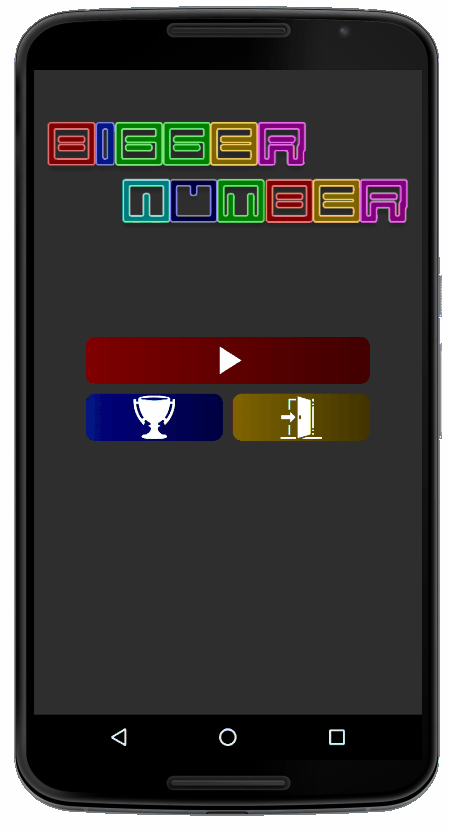

# Bigger Number Game

## Description
This project is about simple android game. You should choose bigger number in the layout. There are 10 levels in this game. Each level numbers and their ranges is changing. Forexample, in the first level you should choose bigger number from two and second level from three. If the player consecutively gives correct answer, the level will increase.Five consecutive answer will increase level by 1.

